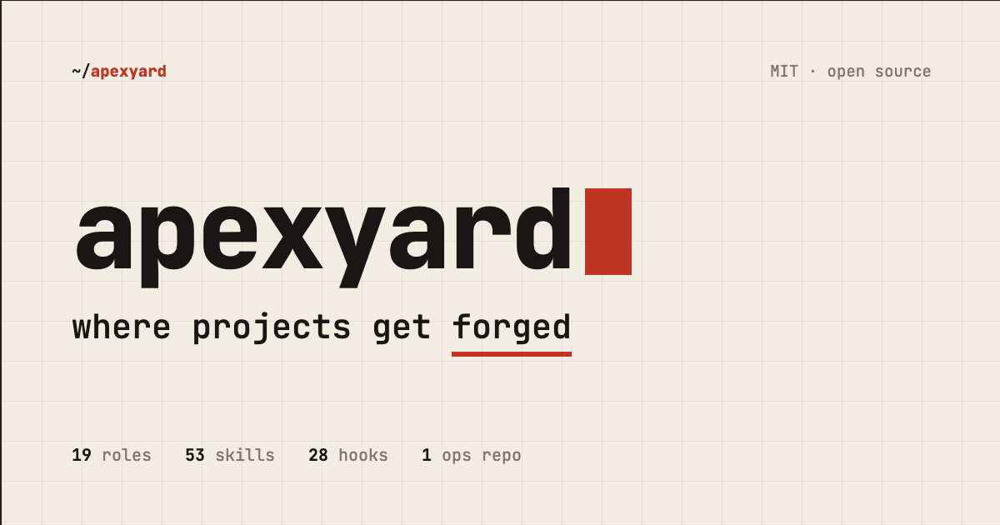

<p align="center">
  <a href="https://yard.apexscript.com"></a>
</p>

# ApexYard

[](LICENSE) [](https://claude.com/claude-code) [](CONTRIBUTING.md)

**Where projects get forged.**

A multi-project ops repo where your projects reference each other, learn from shared experience, and ship production-ready under a strict SDLC. Built for founders who ship alone, or companies standing up AI-enabled squads.

You don't *add* apexyard to a project — projects get forged *inside* it. One ops repo. Every product. Shared memory. Strict gates. Production-ready MVPs.

Claude Code is the default driver, but the rules, hooks, and templates are plain markdown and shell. Swap the AI. Keep the forge. No SaaS. No lock-in.

**Proven shipping** TypeScript + AWS Lambda backends, Next.js web apps, Chrome extensions, and native **Swift** macOS desktop apps. The stack is process and guardrails — not a language or framework lock-in.

## What's Inside

```
apexyard/
├── CLAUDE.md              # Stack entry point -- Claude Code reads this first
├── onboarding.yaml        # Your company config -- fill this in to adopt the stack
│
├── roles/                 # AI agent role definitions (20 across 6 departments)
│   ├── engineering/       # Backend, Frontend, QA, Platform, SRE, Tech Lead, Head of Eng
│   ├── architecture/      # Solution Architect (Tariq)
│   ├── product/           # Product Manager, Product Analyst, Head of Product
│   ├── design/            # UI Designer, UX Designer, Head of Design
│   ├── security/          # Security Auditor, Penetration Tester, Head of Security
│   └── data/              # Data Analyst, Data Engineer, Head of Data
│
├── workflows/             # Development lifecycle processes
│   ├── sdlc.md            # Full SDLC including the database-migration sub-workflow
│   ├── code-review.md     # Code review process and standards
│   └── deployment.md      # Environment promotion, rollback, IaC patterns
│
├── templates/             # Reusable document templates
│   ├── prd.md             # Product Requirements Document
│   ├── technical-design.md # Technical design document
│   ├── adr.md             # Architecture Decision Record
│   ├── agdr.md            # Agent Decision Record (AI-specific)
│   ├── agdr-migration.md  # Migration-specific AgDR (rollback, downtime, consumers)
│   └── architecture/      # C4 diagram templates — Context (L1) + Container (L2), Mermaid
│
├── .claude/               # Claude Code primitives (the runnable layer)
│   ├── settings.json      # Hook wiring (PreToolUse, PostToolUse, SessionStart)
│   ├── hooks/             # 40 shell scripts — ticket-first, migration gate, two-marker merge gate, red-CI block, secrets scan, branch/PR validation, leak protection, MCP-reindex advisories, upstream-drift banner
│   ├── rules/             # 12 modular rule files imported via @.claude/rules/* (agdr-decisions, code-standards, git-conventions, leak-protection, loop-mode, parallel-work, plan-mode, pr-quality, pr-workflow, role-triggers, ticket-vocabulary, workflow-gates)
│   ├── agents/            # 24 sub-agents — Rex (Code Reviewer), Hakim (Security Auditor), Tariq (Solution Architect), the engineering / product / design / data / security personas, plus utility agents (PR & ticket managers, dependency auditor)
│   └── skills/            # 59 slash commands — see CLAUDE.md for the full list
│
├── workspace/             # Live local clones of managed projects — gitignored
├── projects/              # Per-project committed docs (README, roadmap, AgDRs, updates)
├── apexyard.projects.yaml.example  # Portfolio registry template
│
├── golden-paths/          # Reusable infra & ops templates
│   └── pipelines/         # Drop-in GitHub Actions workflows (CI, code quality, Swift CI, security, dependency audit, PR title check, review check, SEO check)
│
├── docs/                  # Documentation
│   ├── getting-started.md # Setup guide
│   └── multi-project.md   # Full setup guide (fork flow, directory layout, daily workflow, FAQ)
│
└── site/                  # Landing page (deployed to yard.apexscript.com)
    ├── index.html
    ├── architecture.html
    ├── skills.html
    ├── robots.txt         # Crawler directives + sitemap pointer
    ├── sitemap.xml        # XML sitemap for search engines
    ├── llms.txt           # llmstxt.org manifest — AI/LLM crawler index
    ├── llms-full.txt      # Full-content concatenation for one-shot LLM consumption
    ├── skill.md           # Capability manifest for AI coding agents (upstream GEO/AEO convention)
    └── og/                # Open Graph share-preview PNGs
```

> **For AI coding agents:** the repo root carries `AGENTS.md` — universal entry doc for Cursor / Claude Code / Aider / Cline. `site/skill.md` (lowercase, distinct from `.claude/skills/<name>/SKILL.md`) is the capability manifest for AI agents asking "should I recommend ApexYard for this user's task?".

## Quick Start — fork and go

ApexYard governs a **portfolio of repos** as one organisation. You fork apexyard, clone the fork, treat it as your "ops repo", and register every project you want under management. No `.apexyard/` symlinks, no nested installs — the fork IS the ops repo.

### 1. Star + Fork on GitHub

Visit [`github.com/me2resh/apexyard`](https://github.com/me2resh/apexyard), **Star** it, then **Fork** it into your org. You can keep the fork named `apexyard` or rename to something that fits your naming convention (`your-org/ops`, `your-org/apex`, etc.).

### 2. Clone your fork locally

```bash
gh repo clone your-org/apexyard
cd apexyard
```

Or with plain git:

```bash
git clone https://github.com/your-org/apexyard.git
cd apexyard
```

### 3. Add `upstream` for future updates

```bash
git remote add upstream https://github.com/me2resh/apexyard.git
```

Later, run **`/update`** to pull the latest apexyard improvements into your fork — it previews the upstream diff, merges on a sync branch, and walks you through any per-version migrations (don't hand-merge `main`).

### 4. Configure the framework — run `/setup`

Run **`/setup`** in Claude Code. In three exchanges (describe your stack → review the proposed defaults → accept or tweak) it captures your company, team, tech stack, and quality bar and writes your config.

```text
/setup
```

Your real config lives in `onboarding.yaml`, which is **gitignored** — it stays local and is never published. `/setup` copies it from the tracked `onboarding.example.yaml` placeholder and fills it in, so nothing private is committed. (A commit-time guard blocks a filled-in `onboarding.yaml` if you ever try to add it.)

### 5. Register your projects — run `/handover`

Projects join the portfolio through a skill, not hand-edited YAML. For each repo you want under management:

```text
/handover <repo-url-or-local-path>
```

**`/handover`** clones the repo, scores its "harnessability" across five dimensions, seeds its per-project docs, and **registers it in `apexyard.projects.yaml`** (creating the registry on first use). `/setup` also offered to register your first project back in step 4.

The registry it maintains looks like this — you rarely touch it by hand:

```yaml
version: 1
projects:
  - name: example-app
    repo: your-org/example-app
    docs: projects/example-app
    status: active
```

Register even a single repo — the portfolio skills (`/projects`, `/inbox`, `/status`) work off the registry. (Prefer to bootstrap it manually? `cp apexyard.projects.yaml.example apexyard.projects.yaml` still works.)

### 6. Start working

```
/projects          # list every managed project + status
/inbox             # PRs, issues, comments needing your attention
/status            # git + CI snapshot per project
/decide            # make a technical decision (creates an AgDR)
```

The hooks fire on every `git` / `gh` command, the portfolio skills aggregate across the registry, and the Code Reviewer agent can be invoked with `/code-review <pr>`.

Full setup guide with directory layout, daily workflow, and FAQ: [`docs/multi-project.md`](docs/multi-project.md).

Keeping a fork current — upgrade in place, when to re-fork instead, and how to preserve your portfolio data either way: [`docs/upgrading.md`](docs/upgrading.md).

## Why ApexYard?

**The problem**: Claude Code is powerful, but without structure it produces inconsistent results. Every team reinvents the same processes -- role definitions, review checklists, document templates, workflow gates.

**The solution**: ApexYard provides that structure as a reusable, open-source stack. One config file to customize, 20 role definitions to use, battle-tested workflows to follow, and 40 shell hooks that enforce the rules mechanically.

### What makes it different

| Feature | Without ApexYard | With ApexYard |
|---------|-------------------|----------------|
| Code reviews | Ad-hoc prompts | Rex agent on every PR, SHA-bound approval marker |
| Technical decisions | Lost in chat history | Documented as Agent Decision Records |
| Quality gates | Hope and pray | 40 shell hooks block bad commits, forged markers, unreviewed merges |
| Merge approval | Informal "LGTM" | Two-marker gate — Rex (code) + CEO (per-PR explicit) |
| Database migrations | Drop-column-on-Friday | Dedicated gate: labelled ticket + migration AgDR (rollback, downtime, consumers) required before schema edits |
| Architecture docs | Nobody draws them | C4 L1 + L2 Mermaid templates + `/c4` skill generates stubs from a codebase |
| Portfolio visibility | Tab through 5 GitHubs | `/inbox`, `/status`, `/tasks` aggregate across a single registry file |
| Upstream sync | Forget for 6 months | Session-start drift banner + `/update` skill |
| Role consistency | Re-explain every session | Persistent role definitions, activation-triggered |
| Onboarding | Days of context-setting | `/setup` three-exchange config |

## Roles

ApexYard includes 20 software development roles across 6 departments:

### Engineering (7 roles)

- **Head of Engineering** -- Technical strategy, architecture standards, quality
- **Tech Lead** -- Feature design, code review, team coordination
- **Backend Engineer** -- Domain logic, APIs, infrastructure
- **Frontend Engineer** -- UI components, design system, accessibility
- **QA Engineer** -- Test strategy, automation, quality gates
- **Platform Engineer** -- CI/CD, infrastructure as code, developer tooling
- **Site Reliability Engineer** -- Monitoring, incidents, SLOs

### Architecture (1 role)

- **Solution Architect** (Tariq) -- Independent design review before Build: NFRs, patterns, tech-debt, risk, traceability — the non-code analog of the Code Reviewer

### Product (3 roles)

- **Head of Product** -- Roadmap, prioritization, feasibility
- **Product Manager** -- PRDs, user stories, acceptance criteria
- **Product Analyst** -- Market research, metrics, competitive analysis

### Design (3 roles)

- **Head of Design** -- Design system, UX principles, visual standards
- **UI Designer** -- Visual design tokens, component specifications
- **UX Designer** -- User flows, information architecture, usability

### Security (3 roles)

- **Head of Security** -- Security strategy, threat modeling, compliance
- **Security Auditor** -- Static analysis, vulnerability detection, OWASP
- **Penetration Tester** -- Active testing, exploit discovery, API security

### Data (3 roles)

- **Head of Data** -- Analytics strategy, data governance, reporting
- **Data Analyst** -- SQL, dashboards, A/B testing, metrics
- **Data Engineer** -- ETL pipelines, data modeling, data quality

## Workflows

### Software Development Lifecycle (SDLC)

```
Planning --> Design --> Build --> Review --> QA --> Deploy --> Monitor
```

Each phase has entry criteria, activities, exit criteria, and quality gates. See [`workflows/sdlc.md`](workflows/sdlc.md) for the full flow.

### Code Review Process

Structured review with:

- Author responsibilities and PR description format
- Reviewer checklist (architecture, security, testing, performance)
- Feedback severity levels (blocking, suggestion, question)
- Response time targets
- Rex (code-reviewer agent) auto-runs on every PR; human reviewer activates per role triggers

### Deployment Process

- Infrastructure as Code patterns
- CI/CD pipeline stages
- Environment promotion (staging → production)
- Rollback procedures

See [`workflows/deployment.md`](workflows/deployment.md) for the full flow.

### Database Migration Sub-Workflow

Migrations are high-blast-radius work and get their own gate (workflow gate 3a). Any edit to `migrate-*.{ts,js,py,sql}`, `**/migrations/**`, `prisma/schema.prisma`, `alembic/versions/*`, or similar requires:

1. A labelled `migration` ticket
2. A matching migration AgDR that documents rollback, estimated downtime, cross-service consumers, data volume, testing plan, observability

The `/migration` skill creates both artefacts in one guided flow; the `require-migration-ticket.sh` hook blocks edits to migration paths until they exist.

## Templates

| Template | Purpose |
|----------|---------|
| PRD | Product Requirements Document with user stories, acceptance criteria |
| Technical Design | Architecture, domain model, API design, implementation plan |
| ADR | Architecture Decision Record for significant technical decisions |
| AgDR | Agent Decision Record — AI-specific decision tracking |
| Migration AgDR | Migration-specific AgDR — rollback plan, downtime estimate, consumers, observability |
| C4 Context (L1) | System context Mermaid diagram — external actors + system boundary |
| C4 Container (L2) | Container Mermaid diagram — deployable units inside the system |

## Customization

ApexYard is designed to be customized. Every role, workflow, and template can be modified to fit your team:

1. **Add roles**: Create new `.md` files in `roles/your-department/`
2. **Modify workflows**: Edit files in `workflows/`
3. **Add templates**: Drop new templates in `templates/`
4. **Override anything**: The stack is just markdown files -- edit freely

## Contributing

Contributions are welcome — **start with [CONTRIBUTING.md](CONTRIBUTING.md)** for the full fork → PR → review flow, and open issues with the **Bug report** / **Feature request** templates. Security issues go through [SECURITY.md](SECURITY.md) (private reporting), not public issues.

ApexYard runs on its own rules, so the flow mirrors any project under ApexYard governance:

1. **File an issue** — open a GitHub issue with the **Bug report** / **Feature request** template. If you run apexyard yourself, the **`/report-apexyard-bug`** and **`/request-apexyard-feature`** skills file it here for you (they target `me2resh/apexyard` — distinct from `/bug` and `/feature`, which file into your *own* managed project).
2. **Start the ticket** — `/start-ticket <number>` so the ticket-first hook lets your code edits through.
3. **Branch + commit** — `{type}/GH-{number}-{short-description}`, conventional commit format (`type(#number): subject`).
4. **Self-check before pushing** — `npm run lint` / markdownlint / shellcheck as applicable; hooks remind you at `git push`.
5. **Open a PR** — title `type(#number): description` + a Glossary section in the body.
6. **Wait for Rex** — the Code Reviewer agent auto-runs on every PR.
7. **Merge requires two markers** — Rex's approval + explicit per-PR CEO approval via `/approve-merge <pr>`. Plan-level "go" doesn't count.

For larger changes (new skills, rule changes, workflow redesigns), open a discussion or draft PRD first.

## Contributors

Thanks to everyone who has helped forge ApexYard:

[](https://github.com/me2resh/apexyard/graphs/contributors)

## License

MIT License. See [LICENSE](LICENSE) for details.

---

Built with real-world experience shipping software with Claude Code.
