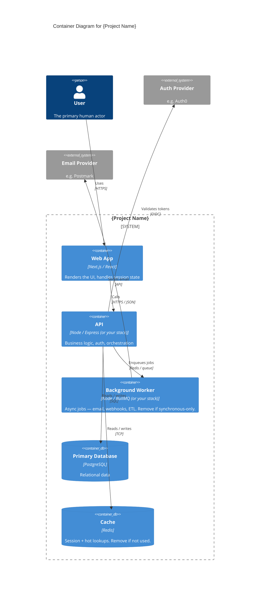

<!-- Source: ApexYard · templates/architecture/c4-container.md · github.com/me2resh/apexyard · MIT -->

# Container Diagram — {Project Name}

> **C4 Level 2** — the system broken down into deployable/runnable containers. Audience: the dev team. One diagram per managed project; usually zoomed in from the L1 context diagram.

## Diagram

## How to use this template

1. Copy this file to `docs/architecture/container.md` (inside a project repo) or `projects/{name}/architecture/container.md` (in the ApexYard portfolio docs).
2. Replace `{Project Name}` and every placeholder inside the `C4Container` block with your real containers.
3. A "container" in C4 terms is a **deployable / runnable unit**: a web app, a mobile app, an API, a database, a queue, a worker. It is NOT a Docker container (confusing but standard). Use the tech label to name the runtime (`Next.js`, `PostgreSQL`, `Redis`, etc.).
4. Keep it to **5–9 containers max**. More than that and you're probably drawing L3 detail inside an L2.
5. Commit. Renders on GitHub.

## What goes in L2 (container)

- Every deployable unit: web apps, mobile apps, APIs, workers, databases, caches, queues.
- People only on the boundary — show how they enter the system, not how they thread through every internal container.
- External systems from L1 that the containers actually talk to (keep the boundary; remove external systems nothing internal calls).
- Arrows with **direction** and a **short label** describing the interaction (`Calls` with `HTTPS / JSON`, `Enqueues jobs` with `Redis`). The protocol matters — it's half the point of L2.

## What does NOT go in L2

- Classes, functions, modules inside a container — that's L3.
- External systems from L1 if no internal container talks to them — drop them; they clutter the picture.
- Deployment topology (regions, AZs, load balancers) — separate diagram if needed.
- Every single side service (logging, metrics, tracing) — include only if they shape the architecture. Usually a "observability goes to DataDog" note in the accompanying prose is enough.

## Relation to the L1 context diagram

The L2 container diagram is the L1 system "zoomed in" — you should be able to collapse every container back into the single `System(main, ...)` box from the L1 diagram and the external relationships should still match. If they don't, one of the two diagrams is wrong.

## Maintenance

More volatile than L1. Changes when:

- A new container is added (new worker, new mobile app, new cache layer)
- A container is split or merged
- The communication pattern changes (e.g. API direct-reads-DB → API goes through a read replica)

Expect to update this every few releases of significant architectural work. If it's changing every sprint, your architecture is churning faster than it should be.

## References

- [C4 Model — Level 2](https://c4model.com/diagrams/container)
- [Mermaid C4 syntax](https://mermaid.js.org/syntax/c4.html)
- ApexYard's own L2 for reference: `docs/architecture/apexyard-container.md`
