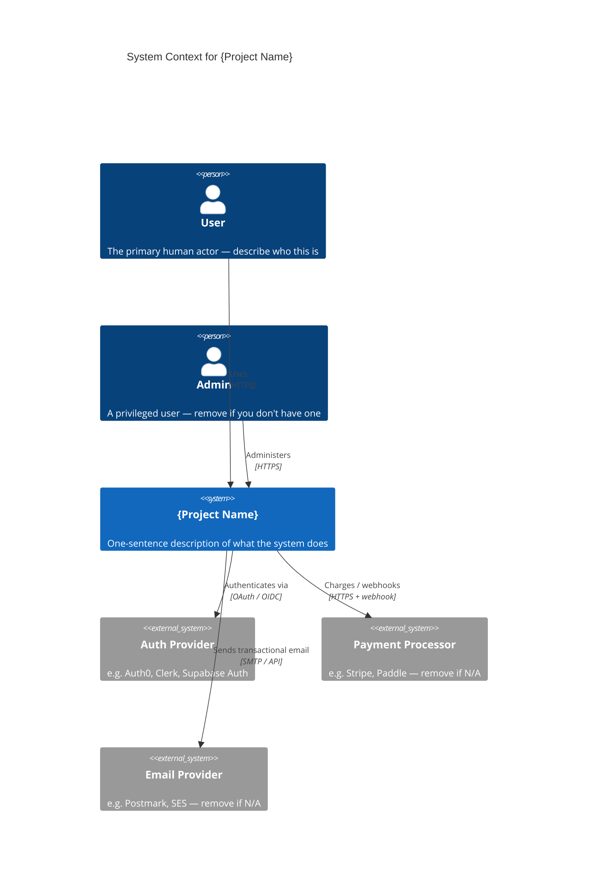

<!-- Source: ApexYard · templates/architecture/c4-context.md · github.com/me2resh/apexyard · MIT -->

# System Context — {Project Name}

> **C4 Level 1** — the system and everyone/everything it talks to. Audience: everyone. One diagram per managed project.

## Diagram

## How to use this template

1. Copy this file to `docs/architecture/context.md` (for code-level diagrams inside a repo) or `projects/{name}/architecture/context.md` (for portfolio-level ApexYard docs).
2. Replace every `{Project Name}` and every placeholder in the `C4Context` block with your real system.
3. Remove external systems you don't use, add the ones you do.
4. Keep the diagram **one screen tall on GitHub**. If it doesn't fit, you're probably trying to show L2 detail in an L1 diagram — create the container diagram instead (see `c4-container.md`).
5. Commit. GitHub renders the diagram inline in the file view — no build step.

## What goes in L1 (context)

- The system (one box, your name on it)
- **People** who use the system (users, admins, operators)
- **External systems** the system depends on (auth, payments, email, third-party APIs, cloud services — at the level of "we talk to Stripe", not "the `stripe-node` client in the backend calls `stripe.charges.create`")
- Arrows showing the direction and gist of interaction

## What does NOT go in L1

- Internal containers (frontend / backend / database) — that's L2. If you find yourself drawing them here, you're conflating levels.
- Deployment topology (regions, load balancers, CDNs) — that's a separate concern. C4 doesn't cover it; use a deployment diagram elsewhere if you need one.
- Code-level details (classes, functions, database schema) — L3 or L4 if you ever need them.

## Maintenance

The L1 diagram should change maybe once or twice a year — only when the system's external relationships change (new integration, removed dependency, new class of users). If you find yourself updating it every sprint, you're probably putting L2 details in it.

## References

- [C4 Model — Level 1](https://c4model.com/diagrams/system-context)
- [Mermaid C4 syntax](https://mermaid.js.org/syntax/c4.html)
- ApexYard's own L1 for reference: `docs/architecture/apexyard-context.md`
