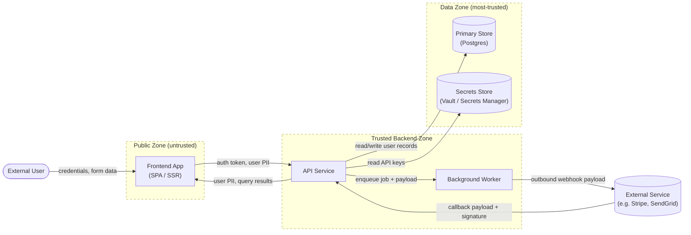

<!-- Source: ApexYard · templates/architecture/dfd.md · github.com/me2resh/apexyard · MIT -->

# Data Flow Diagram — {Project Name / Feature}

> **Use a DFD when you need to identify trust boundaries + data crossings** — most often as input to a STRIDE threat model (see [`../audits/threat-model.md`](../audits/threat-model.md)). Sibling: [`c4-context.md`](c4-context.md) for L1 system context (different shape, less data-flow-focused).
>
> Audience: tech leads, security auditor, threat-model facilitator. One DFD per system *or* per high-value flow (auth handshake, payment flow, admin export — each typically benefits from its own DFD when threat-modelled).

## Diagram

The dashed subgraph borders mark **trust boundaries**. Every arrow that crosses a boundary is a candidate for STRIDE analysis — that's where authentication, authorisation, and data-classification rules apply most acutely. Annotate every arrow with the data it carries (`|auth token|`, `|user PII|`, `|callback payload + signature|`) — unlabelled arrows lose half their value.

Replace the placeholders with your real actors, services, stores, and external systems. Keep external systems and external users **outside all subgraphs** — they belong to other people's trust zones.

---

## Trust boundaries

| From | To | Authentication mechanism | Data classification |
|------|-----|--------------------------|---------------------|
| External User → Frontend | (browser session) | None at the network edge — TLS only | Credentials (in flight only), form input |
| Frontend → API | TLS + bearer token (JWT / session cookie) | OAuth 2 / OIDC bearer | Auth token, user PII, request body |
| API → Frontend | TLS (server auth via cert) | n/a (server is trusted by the client) | User PII, query results |
| API → Primary Store | mTLS or VPC-internal + DB credentials from secrets store | DB user/password | All persistent user records — highest sensitivity |
| API → Secrets Store | IAM role / service identity | mTLS + IAM | API keys, tokens — secrets-class |
| API → Worker | Internal queue (auth via shared transport credentials) | Queue ACL | Job payload — may contain user PII |
| Worker → External Service | TLS + API key | API key from secrets store | Outbound webhook payload — sanitise before sending |
| External Service → API | TLS + signed callback | HMAC signature verified per call | Callback payload — never trust the body without verifying the signature first |

Add / remove rows to match your real arrows. The four columns are deliberate:

- **Authentication mechanism** — what *proves identity* on this hop. "TLS only" is not authentication.
- **Data classification** — what *category of data* crosses this hop. Use whatever scheme your org uses (PII / Credentials / Secrets / Public / Internal). Threat-modelling output will weight risks against this.

---

## Notes

Each crossing of a trust boundary is where STRIDE threats apply most acutely:

- **Spoofing** — can the source's identity be forged on this hop?
- **Tampering** — can the data be modified in transit / at the receiver?
- **Repudiation** — can the sender deny having sent this?
- **Information disclosure** — what leaks if this hop is intercepted?
- **Denial of service** — what's the failure mode if this hop is overwhelmed?
- **Elevation of privilege** — does crossing this boundary grant additional permissions, and are those bounded correctly?

The DFD is meant to be **re-drawn as the system evolves** — don't treat it as one-shot. New actor → new arrow → new STRIDE pass. New trust zone (e.g. introducing a third-party data processor) → new dashed subgraph → new boundary row.

Pair this DFD with a STRIDE threat model in [`../audits/threat-model.md`](../audits/threat-model.md) so the boundary table feeds directly into a per-arrow threat enumeration. The DFD without a threat model is just a picture; the threat model without a DFD has no anchor.

---

## References

- [`c4-context.md`](c4-context.md) — L1 system context (sibling: less data-flow-focused, no trust-boundary semantics)
- [`../audits/threat-model.md`](../audits/threat-model.md) — STRIDE threat model template that consumes this DFD
- [Mermaid `flowchart` syntax](https://mermaid.js.org/syntax/flowchart.html)
- [STRIDE — Microsoft Security Development Lifecycle](https://learn.microsoft.com/en-us/azure/security/develop/threat-modeling-tool-threats)
- [AgDR-0003: Mermaid C4 for diagrams](../../docs/agdr/AgDR-0003-mermaid-c4-for-diagrams.md) — why every architecture diagram in apexyard is Mermaid
