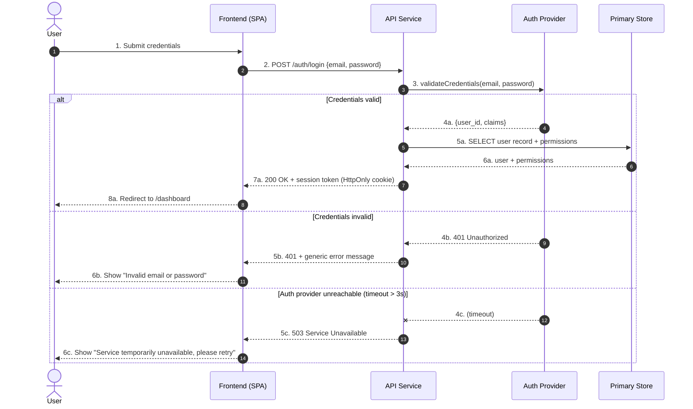

<!-- Source: ApexYard · templates/architecture/sequence.md · github.com/me2resh/apexyard · MIT -->

# Sequence Diagram — {Flow Name}

> **Use a sequence diagram for request-flow walkthroughs** (auth handshake, payment flow, webhook callback, async job dispatch, etc.) where the *time-ordered interaction between components* is the load-bearing detail. Sibling: [`c4-container.md`](c4-container.md) for static container topology — same components, different question (*who talks to whom* vs *in what order*).
>
> Audience: tech leads, on-call engineers, anyone debugging this flow at 2 AM. One sequence diagram per non-trivial request flow — don't draw one for a CRUD GET.

## Diagram

Replace the actors and messages with your real flow. Conventions:

- **`autonumber`** numbers messages so failure-mode rows can reference them by index.
- **`actor` vs `participant`** — `actor` for human / external systems, `participant` for internal components.
- **Solid arrow `->>`** = synchronous call. **Dashed arrow `-->>`** = response. **Dashed-X `--x`** = timeout / dropped message.
- **`alt` / `else` blocks** model branching paths. Cover at least one failure branch — the happy path alone is rarely the load-bearing knowledge.
- Keep to **5–9 messages per `alt` branch**. More than that and you're either drawing two flows in one diagram or pasting code logic into a picture.

---

## When this flow runs

- [Trigger 1 — e.g. user submits the login form on the marketing site]
- [Trigger 2 — e.g. session expires and the SPA receives a 401 from any protected endpoint, redirecting to /login]
- [Trigger 3 — e.g. SSO callback from the identity provider lands on /auth/callback]

If a flow has only one trigger, say so explicitly. If a flow has many, list them all — that surfaces shared-flow risk (a bug in this sequence affects every entry-point).

---

## Failure modes

| # | Branch | Cause | Detection | Recovery |
|---|--------|-------|-----------|----------|
| 4b | Credentials invalid | User typo, brute-force attempt, password reset not yet propagated | Counter on `auth.login.invalid` metric; lockout after N consecutive failures per IP / per user | User retries; on Nth failure, throttle + show "reset password" CTA |
| 4c | Auth provider unreachable | Provider outage, network partition, expired CA certificate | `auth.provider.timeout` metric + synthetic check on `/auth/health` | Frontend shows degraded-mode message; on-call paged if synthetic fails for > 5 min; failover to backup IdP if configured |
| 5a | DB unavailable | Primary failover, connection pool exhausted | `db.query.error_rate` metric > threshold | Retry with exponential backoff (max 3); fail closed with 503 if pool exhausted |
| 7a | Cookie set but request races a navigation | User clicked twice / cookie domain mismatch on staging | Browser-side error logger picks up `auth.cookie.missing` after redirect | Frontend re-attempts the auth check on /dashboard once before bouncing back to /login |

Add one row per `else` branch in the diagram, plus one per silent failure that doesn't show in the diagram (DB error mid-happy-path, etc.). The four columns are deliberate:

- **Cause** — what went wrong (root cause, not symptom)
- **Detection** — how you find out it went wrong (metric, log, synthetic, user report)
- **Recovery** — what the system / user does to recover (automatic retry, human runbook, accept-and-degrade)

---

## Notes

- **Idempotency.** This flow [is / is not] idempotent. If the user double-clicks "Submit", the second call [returns the same session / creates a duplicate record / no-ops via idempotency key]. Document the actual behaviour, not the aspirational one.
- **Retry semantics.** The Frontend [retries automatically on 5xx with backoff / does not retry / shows a manual retry button]. The API [is safe to retry / requires an idempotency key / must not be retried because step N is non-idempotent].
- **Observability hooks.** Each numbered message emits a structured log line with `trace_id`, `user_id`, and `flow=auth.login`. Latencies are bucketed in the `auth.login.duration_ms` histogram. The full trace is queryable in [link to your APM tool] by `trace_id`.

Keep this section to 1–2 sentences per concern. If it grows past a paragraph, the answer is probably its own page (a runbook, a separate AgDR), not more text here.

---

## References

- [`c4-container.md`](c4-container.md) — static container topology (sibling: same components, different question)
- [`dfd.md`](dfd.md) — data-flow diagram (sibling: trust-boundary view of the same components, useful when sequence diagrams cross security boundaries)
- [Mermaid `sequenceDiagram` syntax](https://mermaid.js.org/syntax/sequenceDiagram.html)
- [AgDR-0003: Mermaid C4 for diagrams](../../docs/agdr/AgDR-0003-mermaid-c4-for-diagrams.md) — why every architecture diagram in apexyard is Mermaid
