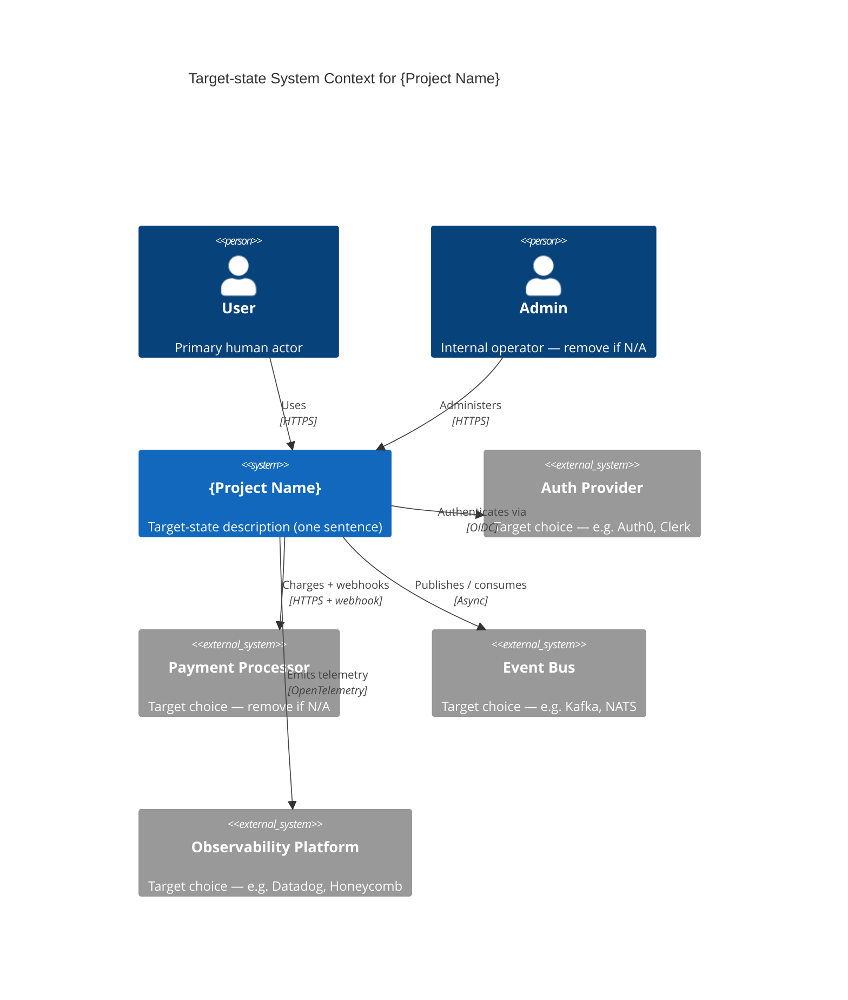

<!-- Source: ApexYard · templates/architecture/vision.md · github.com/me2resh/apexyard · MIT -->

# Architecture Vision — {Project Name}

> **North-star architecture.** Use `vision.md` for *target-state* + the *current → target migration path*. Use [`c4-context.md`](c4-context.md) for the as-is system context. Use [`c4-container.md`](c4-container.md) for the as-is container topology. Vision is the only template here that explicitly addresses *where the architecture is going* and *what we are choosing not to build*.
>
> Audience: tech leads, head of engineering, the CTO. Reviewed every quarter (default cadence — see § Review cadence below). One vision per system / domain.
>
> **Recommended authoring path:** run `/tech-vision <project-name>` — interactive section-by-section interviewer that forces the load-bearing sections (Current-vs-Target, Anti-scope, Migration path) to actually get filled in instead of left as stubs. Markdown-only output written to `projects/<project-name>/architecture/vision.md`. Re-run quarterly with `r` (refresh) to preserve content across reviews. See [`.claude/skills/tech-vision/SKILL.md`](../../.claude/skills/tech-vision/SKILL.md).

## Scope

[One short paragraph: which system or domain this vision covers, and why it needs a north-star call now. Example: *"Covers the customer-facing web platform — the user-onboarding journey, billing, and account self-service. Excludes the internal admin console (separate vision) and the data warehouse (owned by the data team)."*]

---

## Principles

5–10 architectural principles that constrain every future call. Keep each one a one-liner. Examples (delete and replace):

1. **Bounded contexts own their data** — no cross-context DB joins. Cross-context reads go through a published API.
2. **Failures are caller-handled, not provider-swallowed** — services surface failures as typed errors; callers decide retry / fallback / degrade.
3. **Idempotency by default** — every state-changing endpoint accepts an idempotency key.
4. **Observability is a feature, not an add-on** — every service ships with structured logs, metrics, and one synthetic check before it leaves staging.
5. **Strict-typed boundaries** — every public interface (HTTP, queue, gRPC) has a versioned schema; breaking changes go through a deprecation window.
6. **Async over sync where the contract allows** — prefer eventual consistency through events; reserve synchronous calls for read-paths the user blocks on.
7. **Stateless compute, stateful storage** — compute units are restart-safe; durable state lives only in named persistence layers (DB, object store, queue).
8. **Single source of truth per concept** — duplication is a migration, not a permanent state.

---

## Target-state architecture

Replace placeholders with the **target** state — not today's state. If today is monolith and target is event-driven, draw the event-driven version here. The current state belongs in the table below.

For deeper detail, link a target-state container diagram (`vision-container.md`) using the [`c4-container.md`](c4-container.md) template structure — keep this page L1.

---

## Current state vs target state

| Dimension | Today | Target | Gap |
|-----------|-------|--------|-----|
| Data layer | [Today, e.g. shared Postgres across services] | [Target, e.g. one Postgres per bounded context] | [Gap, e.g. extract billing tables into a billing-owned DB] |
| Auth | [Today, e.g. session cookies + custom RBAC] | [Target, e.g. OIDC + claims-based authz] | [Gap, e.g. migrate session store to OIDC tokens, replace RBAC table with claim resolver] |
| Deployment | [Today, e.g. EC2 + manual deploy script] | [Target, e.g. ECS + GitHub Actions] | [Gap, e.g. containerise services, build IaC] |
| Observability | [Today, e.g. CloudWatch logs only] | [Target, e.g. structured logs + metrics + traces in Datadog] | [Gap, e.g. instrument with OpenTelemetry, configure exporters] |
| Async messaging | [Today, e.g. cron-driven polling] | [Target, e.g. event-driven via SNS/SQS] | [Gap, e.g. introduce event bus, migrate cron jobs to consumers] |
| Frontend | [Today, e.g. server-rendered Rails views] | [Target, e.g. Next.js + RSC] | [Gap, e.g. extract API layer, port pages incrementally] |
| Secrets management | [Today, e.g. .env files in deploy bundles] | [Target, e.g. AWS Secrets Manager + IAM-scoped reads] | [Gap, e.g. inventory secrets, migrate per-service] |

Add / remove rows to fit the system. The Gap column is what gets sequenced into the migration path below.

---

## Migration path

Multi-quarter milestones. Each milestone is concrete enough to verify ("by Q3, we will have moved X to Y") and small enough to deliver inside a single quarter without freezing other work.

| Quarter | Milestone | Owner | Done when |
|---------|-----------|-------|-----------|
| Q1 26 | [e.g. Extract billing tables into a dedicated billing DB] | [Tech Lead — billing] | [e.g. all billing reads/writes go through the billing service; cross-context join queries fail in staging] |
| Q2 26 | [e.g. Introduce event bus + migrate the welcome-email cron to a consumer] | [Tech Lead — platform] | [e.g. welcome email triggered by `UserRegistered` event; old cron disabled in prod] |
| Q3 26 | [e.g. OIDC migration for the customer-facing web] | [Tech Lead — auth] | [e.g. session cookies retired; web app reads claims from OIDC tokens; admin console still on legacy (separate ticket)] |
| Q4 26 | [e.g. Frontend port — first 5 pages on Next.js] | [Tech Lead — frontend] | [e.g. 5 named pages live on Next.js behind a feature flag; performance budget within 10% of legacy] |

Group dependent milestones into the same quarter only if you can fund both in parallel. If a milestone slips, the *vision* doesn't change — only the date does. Update this table at every quarterly review.

---

## Things we explicitly chose NOT to build

This is the section that prevents wishful-architecture drift. List the patterns, technologies, or capabilities the team has consciously declined — and the rationale, so the next person to suggest one knows we already considered it.

- **[e.g. Microservices below the bounded-context level]** — *Rationale: a 10-service monolith-of-microservices is more painful than a well-bounded modular monolith at our scale. Reconsider when org > 50 engineers OR a bounded context's deploy frequency demands per-service independence.*
- **[e.g. Multi-region active-active]** — *Rationale: the customer base is single-region today; the operational and data-residency cost of active-active outweighs the latency win. Reconsider when expansion lands in a second geographic region with > 100 ms inter-region latency tolerance.*
- **[e.g. Custom authn — building our own OIDC provider]** — *Rationale: identity is not a differentiator; vendor lock-in is acceptable. Reconsider only on a vendor exit event.*
- **[e.g. GraphQL gateway in front of REST APIs]** — *Rationale: aggregator complexity exceeds the over-fetching cost we'd save. Reconsider when we have ≥ 3 client surfaces with materially different field needs.*

The "reconsider when" clause is load-bearing — it prevents the section from rotting into "this was forbidden in 2026 and the rationale is lost".

---

## Review cadence

This vision is reviewed **quarterly** by default (Tech Lead + Head of Engineering + at least one engineer who has shipped against the current state). The review checks:

- Have the migration milestones from the previous quarter shipped? If not, what blocked them?
- Does the target state still match the business direction, or has the business shifted?
- Has anything in "Things we explicitly chose NOT to build" hit its "reconsider when" trigger?
- Are there new gaps to surface in the current-vs-target table?

A quarterly review that produces zero changes is fine — it's still a record that the vision was checked and remains valid.

---

## References

- [`c4-context.md`](c4-context.md) — L1 system context (as-is)
- [`c4-container.md`](c4-container.md) — L2 container view (as-is)
- [`dfd.md`](dfd.md) — data-flow diagram (input to threat modelling)
- [`sequence.md`](sequence.md) — request-flow walkthroughs
- [AgDR-0003: Mermaid C4 for diagrams](../../docs/agdr/AgDR-0003-mermaid-c4-for-diagrams.md) — why every architecture diagram in apexyard is Mermaid
