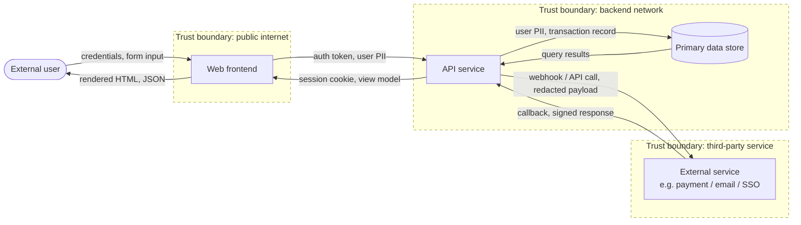

<!-- Source: ApexYard · templates/audits/threat-model.md · github.com/me2resh/apexyard · MIT -->

# Threat Model — {project} @ {short-sha}

> Persisted by `/threat-model` via `_lib-audit-history.sh`. Frontmatter (above) is structured; the body is freeform per dimension. Edit the body freely; keep the frontmatter parseable. See `docs/agdr/AgDR-0019-audit-artefact-persistence.md` for the schema rationale.

## Data Flow Diagram

A Data Flow Diagram (DFD) is the natural input to STRIDE — each crossing of a trust boundary is where threats apply most acutely, and the STRIDE walk in the table below should iterate the boundary crossings rather than invent threats ad-hoc. Replace the placeholders below with your system's actual entities; keep trust boundaries as dashed `subgraph` blocks and label every arrow with the data that crosses it (auth tokens, PII, transaction records, etc.). Mermaid-template choice rationale: see `docs/agdr/AgDR-0003-mermaid-c4-for-diagrams.md`.

Replace placeholders with your system's actual entities. **Each arrow that CROSSES a trust boundary is where STRIDE threats apply most acutely** — drive the table below from the boundary crossings, not from a free-form brainstorm.

## Attack surface

- **Entry points**: {N} (HTTP routes, form handlers, WebSocket endpoints, file uploaders)
- **Data stores**: {N} (databases, caches, file systems, env vars)
- **External integrations**: {N} (third-party APIs, webhooks, SDKs)

## Threats by STRIDE category

| # | Category | Threat | Severity | Entry point | Mitigation |
|---|---|---|---|---|---|
| T1 | Spoofing | (e.g. no rate limit on login) | high | POST /auth/login | Add rate limiter |
| T2 | Tampering | (e.g. no CSRF token on state-changing forms) | high | POST /settings | Add CSRF middleware |
| T3 | Repudiation | (e.g. no audit log on admin actions) | medium | Admin panel | Add structured action log |
| T4 | Information Disclosure | (e.g. stack traces in prod) | medium | Global error handler | Strip traces when NODE_ENV=production |
| T5 | Denial of Service | (e.g. unbounded list endpoint) | medium | GET /items | Add pagination + cap |
| T6 | Elevation of Privilege | (e.g. role check missing on /admin/*) | high | Admin routes | Verify role on every admin handler |

## Recommended priority

Order by severity, then ease-of-fix:

1. T1 — rate limit on /auth/login
2. T2 — CSRF middleware
3. T6 — admin role checks
4. (lower-severity items after)

## OWASP cross-check

- [ ] SQL/NoSQL injection — parameterised queries / ORM throughout?
- [ ] XSS — `dangerouslySetInnerHTML` / `v-html` / template literals in HTML?
- [ ] Insecure deserialization — `JSON.parse` on untrusted input without validation?
- [ ] Security misconfiguration — CORS `*`, debug mode, default credentials?
- [ ] Components with known vulnerabilities — `npm audit` / `pip audit` clean?

## Notes

(Free space for context the table doesn't capture — bounded contexts, trust boundaries, threat-actor assumptions, etc.)
