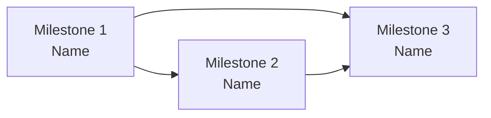

<!-- Source: ApexYard · templates/initiative.md · github.com/me2resh/apexyard · MIT -->

# Initiative: {Initiative Name}

**Status**: Draft | Active | Paused | Done | Cancelled
**Scope**: per-project (`{project}`) | framework-wide
**Quarter / Timeframe**: {e.g. Q3 2026, or 8 weeks from 2026-05-22}
**Owner**: {operator name from git config}
**Created**: YYYY-MM-DD
**Last Updated**: YYYY-MM-DD

---

## Goal

{One sentence — the strategic outcome this initiative achieves. Not a feature list, not a milestone count — the OUTCOME.}

## Success criterion

{What measurable / observable signal makes this initiative "done"? Examples: "X capability shipped to N customers and adopted in Y use cases", "feature flag X removed and the old code deleted", "the OWASP audit on the auth surface returns 0 high-severity findings". Avoid output measures ("ship 10 features"); prefer outcome measures ("10 customers using the new auth flow with no support tickets in 14 days").}

## Scope decision

This initiative is scoped as **{per-project / framework-wide}**. {One-paragraph rationale — why this scope and not the other.}

Per-project initiatives live at `projects/<name>/initiatives/<slug>.md`. Framework-wide initiatives live at `projects/initiatives/<slug>.md`.

---

## Dependency graph

Legend: filed = green; unfiled = yellow; cancelled = red dashed.

## Recommended sequence

Topologically sorted over the DAG above; ties broken by **value × risk-inverse** (high-value, low-risk milestones come first within a topological layer).

1. **{Milestone 1 name}** — no inbound deps; value {L/M/H}, risk {L/M/H}
2. **{Milestone 2 name}** — depends on {Milestone 1}; value {L/M/H}, risk {L/M/H}
3. **{Milestone 3 name}** — depends on {Milestone 1, Milestone 2}; value {L/M/H}, risk {L/M/H}

{Sequence rationale — one paragraph naming the load-bearing decisions: which deps drove the order, which value/risk tie-breaks fired.}

---

## Milestones

### Milestone 1 — {Name}

**Status**: unfiled | filed | in-progress | done | cancelled
**Filing**: {`Filed as [#N](https://github.com/owner/repo/issues/N)` once dispatched, or `unfiled` before the filing step}

- **Success criterion**: {what makes this milestone "done"}
- **Blocks**: {comma list of other milestone names this UNBLOCKS, or `none`}
- **Blocked by**: {comma list of other milestone names this DEPENDS ON, or `none`}
- **Kill criterion**: {what would make you cancel this milestone? — operator may answer `TBD`}
- **Value**: {Low | Medium | High | TBD}
- **Risk**: {Low | Medium | High | TBD}
- **Confidence in time estimate**: {Low | Medium | High | TBD}

{2-3 sentences of context — what's the work, who's involved, what artefacts get produced. This becomes the body of the filed Feature ticket.}

### Milestone 2 — {Name}

**Status**: unfiled
**Filing**: unfiled

- **Success criterion**: ...
- **Blocks**: ...
- **Blocked by**: ...
- **Kill criterion**: ...
- **Value**: ...
- **Risk**: ...
- **Confidence in time estimate**: ...

{context paragraph}

### Milestone 3 — {Name}

{...same shape...}

---

## Open uncertainties

Rolled up from per-milestone `TBD` answers. Each entry names the milestone + the question that was deferred.

- **Milestone 2 — kill criterion**: TBD ({date deferred})
- **Milestone 3 — confidence in time estimate**: TBD ({date deferred})

{If empty: write `None — every milestone has answers for every question.`}

---

## Anti-scope

Things this initiative explicitly will NOT do. Mirrors `templates/architecture/vision.md` § Anti-scope — the items here are the ones the operator considered and rejected, not the ones nobody thought of.

- {anti-scope item 1}
- {anti-scope item 2}

---

## Re-run history

Append-only. Each `/plan-initiative` re-run on this slug adds one entry.

| Date | Delta |
|------|-------|
| YYYY-MM-DD | Initial creation — N milestones, scope=per-project |
| YYYY-MM-DD | Added milestone "X"; filed M1, M2 as #123, #124 |
| YYYY-MM-DD | Resolved kill criterion for M3; cancelled M4 |
